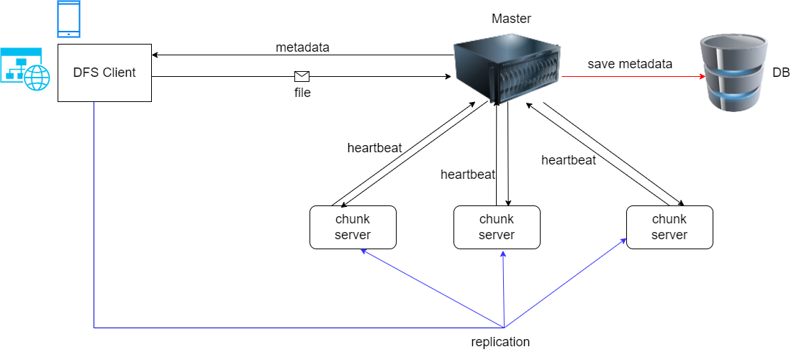
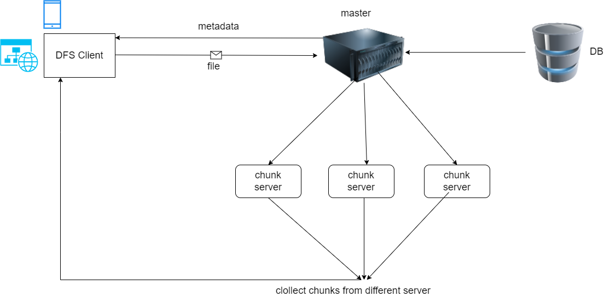

# Distributed File System

<div >
  <h3>DFS is a distributed file system inspired by Google's GFS. It currently uses RPC, Web Socket, and HTTP for communication, is written in Go, and it has a simple react.js-based UI.</h3>
  <br>
  <br>
        Group Members

      - Fikremariam  Anteneh          UGR/9301/13               1
      - Betselot Kidane               UGR/8473/13               1
      - Surafel Workayehu             UGR/9701/13               1
      - Salahadin Juhar               UGR/8613/13               1
      - Yeabtsega Yifat               UGR/9766/13               1

  
  <h3>  Some of the main features include:<h3>
  <ul>
    <li> File Chunking</li>
    <li> File Replication</li>
    <li> File Distribution</li>
  </ul>

  <h3>The User Operations include:</h3>
  <ul>
    <li> File uploading</li>
    <li> File Downloading</li>
  </ul>
  
</div>
  <br>
  <br>
</div>
<p>
Our system has three main parts: the master, chunkserver, and client. The master oversees file details and keeps an eye on chunkserver status. Chunkservers hold pieces of files, and the master tracks where each piece and its copies are stored.

Now, think of the client as the main character. It reads and writes data, interacting with the master and chunkserver to make things happen. It's like a simple but effective digital storytelling where the master manages, the chunkserver stores, and the client navigates the data journey.
</p>

## Write  



Certainly, let's integrate replication into the process during chunking and uploading:

1. Client Initiates File Upload:
   - The client opens the file locally.
   - Creates an `UploadInitRequest` containing the filename and filesize.
   - Sends the request to the master server.

2. Master Server Processing:
   - The master server receives the `UploadInitRequest`.
   - Calculates the required number of chunks and determines which chunk to store on which chunkserver.
   - Creates an `UploadInitResponse` containing information about chunk distribution.
   - Sends the response back to the client.

3. Client File Chunking and Initial Upload:
   - The client splits the file into chunks based on the master's response.
   - For each chunk:
      - Uploads the chunk to a designated chunkserver.
      - Initiates replication simultaneously by saving a copy to another available chunkserver.

4. Chunkserver Reports Success:
   - Upon successful upload of a chunk (including replication) to a chunkserver, the chunkserver reports success for that specific chunk to the master server.

5. Completion of File Upload:
   - Once all chunks (including replicas) are successfully uploaded to their respective chunk servers, the write process is considered complete for the client.

6. Automatic Replication and Success Reporting:
   - The replication process occurs concurrently with the initial chunking and uploading.
   - The client reports success for each chunk (including replicas) to the master server.

7. Master Server Database Update:
   - The master server, upon receiving success messages for each chunk (including replicas), updates its database.

8. File Availability:
   - With replication completed and the master server updated, the file is available for download by clients.

This approach integrates replication seamlessly during the initial chunking and uploading process, ensuring redundancy and fault tolerance from the beginning.

## Read



1. Client Requests File Read:
   - The client sends a read request for a specific file to the master server.

2. Master Server Processing Read Request:
   - The master server retrieves information about chunk distribution for the requested file from the database.
   - Sends a `ReadInitResponse` containing chunkserver details back to the client.

3. Client Requests Chunks for Read:
   - The client sends requests to the designated chunk servers based on the `ReadInitResponse`.

4. Chunkserver Sends Chunks for Read:
   - Chunk servers respond by sending the requested chunks back to the client.

5. Client Assembles Chunks:
   - The client assembles the received chunks to reconstruct the original file.

6. File Read Complete:
   - The client successfully reads and assembles the file from the distributed chunks.


## Example usage ( For Those who wants to run it on Terminal )
```bash
# build minidfs
->make build
# start the master instance on port 8000 using a chunksize of 1MB
->./dfs master --port 8000 --chunkSize 1000000
# start two chunkserver insatnces on port 8001/8002 each using its own storage location
# usually they would run on different machines
-> mkdir data1 data2
-> ./dfs chunkserver --master http://localhost:8000/ --port 8001 --dir ./data1
-> ./dfs chunkserver --master http://localhost:8000/ --port 8002 --dir ./data2

# create a file with random bytes of about 3Mb
-> head -c 3M /dev/urandom > input.txt
# upload the file to the cluster
-> ./dfs client --master http://localhost:8000/ --action write --filename input.txt
# download the file
-> ./dfs client --master http://localhost:8000/ --action read --filename input.txt --output-filename output.txt
# compare the input file to the downloaded output file
-> diff input.txt output.txt
```

